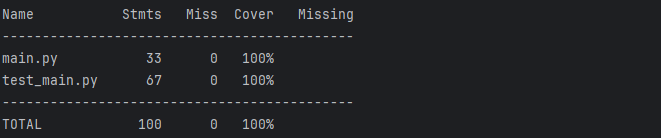
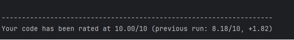
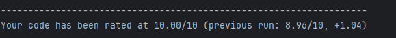

# Домашнее задание по семинару № 6 "Юнит тестирование в других языках"

Тест на покрытие кода `main.py` тестами из `test_main.py` показал 100%.

При использовании инструмента `Pylint` было выявлено, что в `main.py` не хватает аннотаций к модулю, классу и каждому методу, а также некоторые строки были слишком длинные. Добавил аннотации, разбил длинные строки на несколько и `Pylint` показал, что ошибок больше не найдено. 

Протестировал инструментом `Pylint` также и код самого теста `test_main.py`, были выявлены те же ошибки, исправил.

